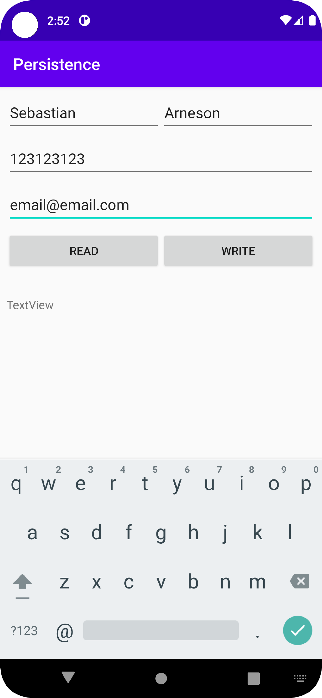
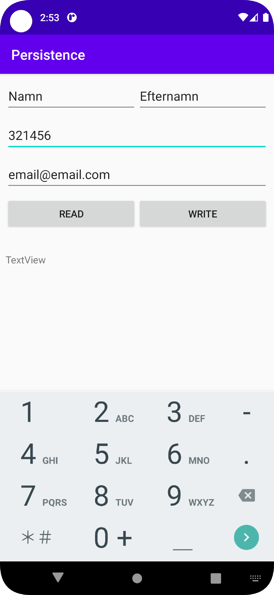
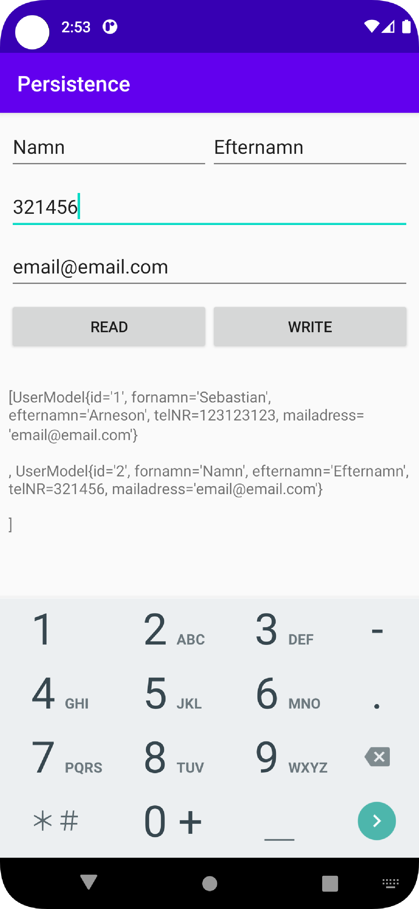

# Rapport

**Rapport SQLite**
Skapat en textView för att visa all sparad data.
Skapat två stycken editTextView, ett för förnamn och ett för efternamn.
Skapat ett EditTextView för telefon nr och ett editTextView för emailadress.
Skapat två knappar, read och write.
Skapat en SQLite databas, genom DataBaseHelper och DatabaseTables.
Implementerat kod för att spara det som står i alla edit text till SQLite Databasen när man klickar på knappen write.

```Java
        btnWrite.setOnClickListener(new View.OnClickListener() {
            @Override
            public void onClick(View view) {
                Log.d("BTN", "btn write clicked");
                addUser(forNamn.getText().toString(), efterNamn.getText().toString(),mailAdress.getText().toString(), Integer.parseInt(telNR.getText().toString()));


            }
        });

    }
    private long addUser (String fornamn, String efternamn, String mailadress, int telnr){
        ContentValues values = new ContentValues();
        values.put(DatabaseTables.Users.COLUMN_NAME_FORNAMN, fornamn);
        values.put(DatabaseTables.Users.COLUMN_NAME_EFTERNAMN, efternamn);
        values.put(DatabaseTables.Users.COLUMN_NAME_MAILADRESS, mailadress);
        values.put(DatabaseTables.Users.COLUMN_NAME_TELNR, telnr);
        Log.d("BTN","" + values);
       return dataBase.insert(DatabaseTables.Users.TABLE_NAME, null, values);
    };
```

Knappen read tog betydligt längre tid än allt annat i denna uppgift.
Missade att skapa en UserModel att spara datan som ska läsas till instancer som sparas i lista.
Efter läst igenom dugga 10ggr extra, tagit hjälp av developer.android.com och youtube lyckades lösa problemet och knappen visar upp all sparad data i text view med en tom rad mellan varje object.SQLite
I DataBaseHelper
```Java

    public List<UserModel> getAllUsers(){
        SQLiteDatabase db = this.getReadableDatabase();
        String queryString = "SELECT * FROM " + DatabaseTables.Users.TABLE_NAME;
        Cursor cursor = db.rawQuery(queryString, null);
        List<UserModel> returnList = new ArrayList<>();

        if(cursor.moveToFirst()) {
            do{
                String ID = cursor.getString(0);
                String fnamn = cursor.getString(1);
                String enamn = cursor.getString(2);
                int telnr = cursor.getInt(3);
                String mail = cursor.getString(4);
                UserModel newUser = new UserModel(ID,fnamn,enamn,telnr,mail);
                returnList.add(newUser);

            }while(cursor.moveToNext());
        }
        else{

        }
        Log.d("BTN", "" + returnList);
        cursor.close();
        return returnList;
    }
```
I UserModel
```Java

    @Override
    public String toString() {
        return "UserModel{" +
                "id='" + id + '\'' +
                ", fornamn='" + fornamn + '\'' +
                ", efternamn='" + efternamn + '\'' +
                ", telNR=" + telNR +
                ", mailadress='" + mailadress + '\'' +
                '}' + "\n" + "\n";
    }

```

Och tillslut koppla detta till MainActivity
```Java
       btnRead.setOnClickListener(new View.OnClickListener() {
            @Override
            public void onClick(View view) {
                Log.d("BTN", "btn read clicked");
                List<UserModel> allUsers = dataBaseHelper.getAllUsers();

                Log.d("BTN", "" +  allUsers.toString());

                viewAll.setText(allUsers.toString());
```






